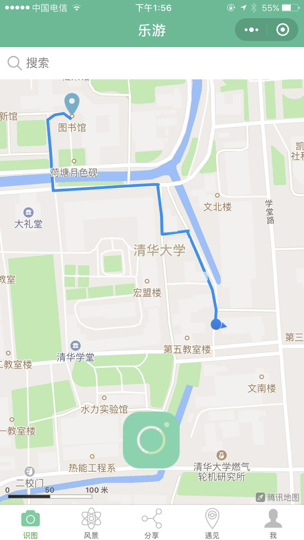
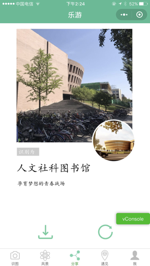
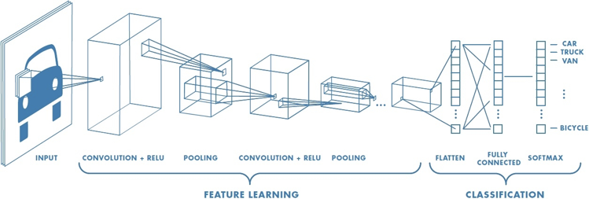

# HappyTour

Project for *Artificial Intelligence: Techniques and Practices (2018)*.

## Introduction

Imagine you are a tourist in a foreign land and you see a building that looks impressive, but there is no tourguide around and it is hard to locate on an electronic map. Thankfully, HappyTour is exactly created for these scenarios. Take a photo with your phone, upload it to the app, and get the answer in no time!

## Get Started

|       Step1: Take a photo of the building of interest        | Step2: Upload and get the name and top stories about the place |      Step 3: Have fun and share a poster with friends!       |
| :----------------------------------------------------------: | :----------------------------------------------------------: | :----------------------------------------------------------: |
|  |  |  |

## How it Works

### Backend

The backend is powered by a image classification network, [VGG19](https://arxiv.org/abs/1409.1556). The architecture we used is shown in the following table. The network is trained on 1,805 photos of 6 buildings in Tsinghua University, which we manually collected with a mobile camera. The training data also includes a "null" class where there's no building presented in the photo. This makes sure that our app works reliably even when the input image is empty. The hyperparameters are selected based on k-fold cross validation.

| Layer Index | Description    | Parameters (width x depth @ resolution) |
| ----------- | -------------- | --------------------------------------- |
| 0           | Conv           | 16x16@128                               |
| 1           | MaxPoolling    | 4x4                                     |
| 2           | Conv           | 5x5@256                                 |
| 3           | MaxPoolling    | 5x5                                     |
| 4           | FullyConnected | Fc1024 (relu)                           |
| 5           | FullyConnected | Fc7 (softmax)                           |

Built with Keras and served with Flask, the model responses in less than 1 second per request and is able to generate output given any input (including empty photos).

## Frontend

The frontend is built with JavaScript, [WXML](https://developers.weixin.qq.com/miniprogram/en/dev/framework/view/wxml/) (similar to HTML) and [WXSS](https://developers.weixin.qq.com/miniprogram/en/dev/framework/view/wxss.html) (similar to CSS) on the WeChat developer platform. When the user uploads a photo, the frontend sends a request to the backend for the prediction results. Once the prediction results are ready, the frontend populates the widgets with the updated contents.

